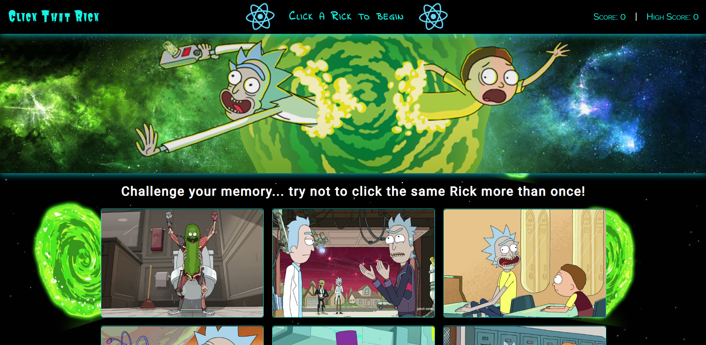

# React-Click-Game

<a href="https://treezcode.github.io/React-Click-Game/" target="_blank">React Click Game</a>

## About 📖
React-Click-Game is a web based memory challenge game built with ReactJS and deployed on Github using GH-Pages.

## How to Use 🤔
The user is challenged to test their memory by clicking on one of the, randomly generated, images of *Rick Sanchez*. The images will then be randomly repositioned and the user must click another *different* image of Rick. If the user clicks the same image then the cards flip, screen shakes and the user score is reset.



Demo: [React-Click-Game](https://treezcode.github.io/React-Click-Game/).

## How it Works 🔨
The `Game.js` component contains a majority of the applications core functionality.

A method for shuffling an array of image URLS is created here and called in the initial state of the component.
```
shuffleArray() {
    // Create copy of current array to modify by value
    const newArr = images.slice();
    // Create new array to store shuffled data
    const shuffledArr = [];
    // Loop thru newArr and get random index based on current length then splice val from newArr and push to shuffledArr
    while (newArr.length > 0) {
        shuffledArr.push(newArr.splice(Math.floor(Math.random() * newArr.length), 1)[0]);
    }
    return shuffledArr;
}
```

The current *this* is bound to the *checkClicked* method and then called in a click event that is attached to each image.
```
checkClicked(guess) {
    // Create copy of wasClicked array to modify by value
    const prevState = this.state.wasClicked.slice();
    // Shuffle images
    const shuffle = this.shuffleArray();
    // Track score
    let score = this.state.score;
    let highScore = this.state.highScore;
    // If user guess is not found in wasClicked
    if (!this.state.wasClicked.includes(guess)) {
        // Store clicked items
        prevState.push(guess);
        // Handle score
        if(score === highScore) {
            score ++;
            highScore++;
        } else {
            score++;
        }
        // Hanlde correct state
        this.setState({
            score: score,
            highScore: highScore,
            navMessage: "Correct",
            navMsgColor: "success",
            allCharacters: shuffle,
            wasClicked: prevState,
            shake: false,
        });
        return setTimeout(() => this.setState({ navMsgColor: "" }), 500);
    }
    // If user guess is found in wasClicked
    if (this.state.wasClicked.includes(guess)) {
        // Hanlde score
        let score = 0;
        // Handle incorrect state
        this.setState({
            score: score,
            highScore: highScore,
            navMessage: "Incorrect",
            navMsgColor: "fail",
            allCharacters: shuffle,
            wasClicked: [],
            shake: true,
            flip: true
        });
        return setTimeout(() => this.setState({ navMsgColor: "", flip: false }), 500)
    }
}
```

## Pre-Requisites ✔️
To power this app locally, you'll need to a install a couple `NPM Packages`. Downloading the following Node packages is crucial for this applications functionality.

* React `npm install react`
* React-Dom `npm install react-dom`
* React-Scripts `npm install react-scripts`

OR

* Shorthand `npm i`

## Getting Started Locally🏁
The following steps will get you a copy of the application up and running on your local machine for testing and grading puproses.

1. Copy this repository from github by using clone.
2. Git clone repository in IDE of choice
3. Navigate to proper directory in IDE
4. If all pre-requisites are met, initalize the app by typing the command `npm run start`
5. The chosen port should automatically open in your browser and ENJOY!

## Technologies Used 💻
* CSS3
* Express
* HTML5
* Javascript ES6
* Node.js
* ReactJS
* VS Code

## Creator ✋
**Joey Kubalak**

AKA 

👇

*Treez* 🌲

Github profile 👉 [TreezCode](https://github.com/TreezCode)